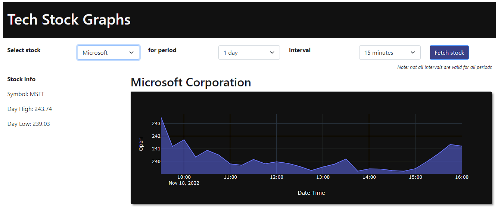

# python-stocks

Top Tech Stocks graphs

## Tech Stack

- Python Flask
- Azure Web App

## Requirements:

- Python version >= 3.8
- Microsoft [Azure Account](https://portal.azure.com/)

## Local Setup

Inspired by https://projectcodeed.blogspot.com/2021/07/how-to-build-stock-tracker-with-plotly.html
